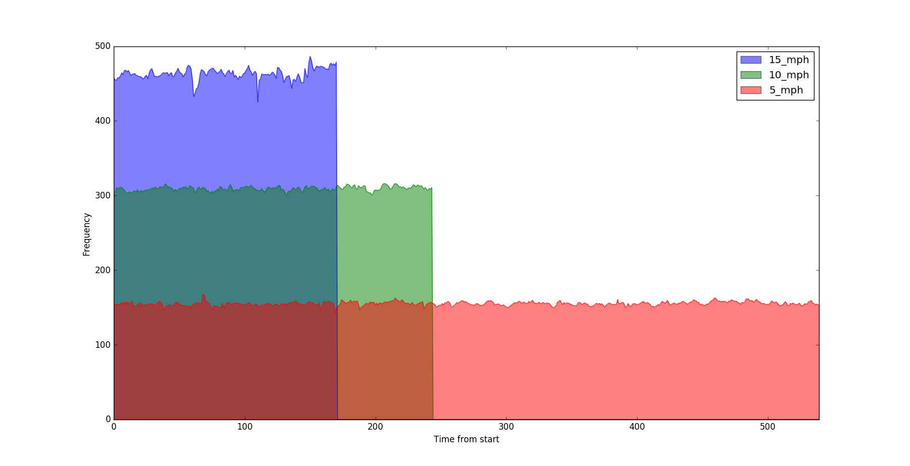

# Dickey John Radar III
- [Link](http://www.dickey-john.com/support/radar-iii/) to Dickey John Radar.
- [Precise Frequency Measurements](http://arduino.datamaster2003.com/f-measurements.htm)
- [Ground Speed Study](https://shareok.org/bitstream/handle/11244/7975/Vishwanathan_okstate_0664M_1511.pdf?sequence=1)

## Lab Setup
Power
- 12V
- 2A
- OCP

## Field Experiment
Radar was attached behind tractor at 35 degrees to calculate relationship between frequency and speed.  3 runs were conducted at 5, 10, and 15 mph.

### Average frequency
- 5 mph = 155.273833333
- 10 mph = 309.395368852
- 15 mph = 463.337017544

